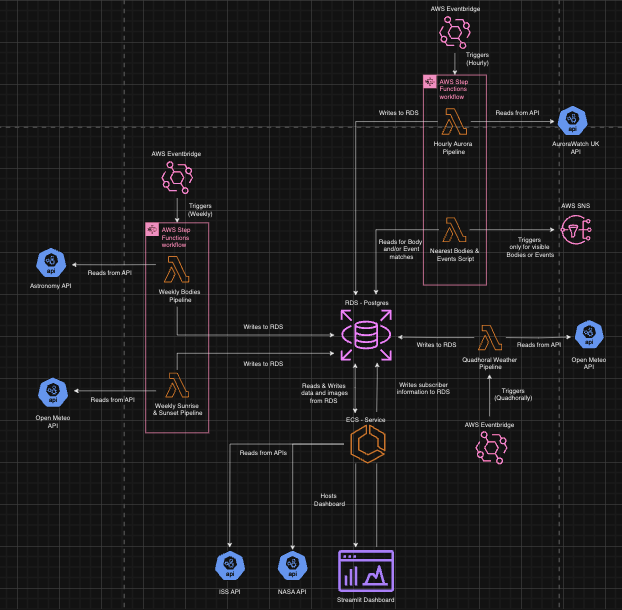
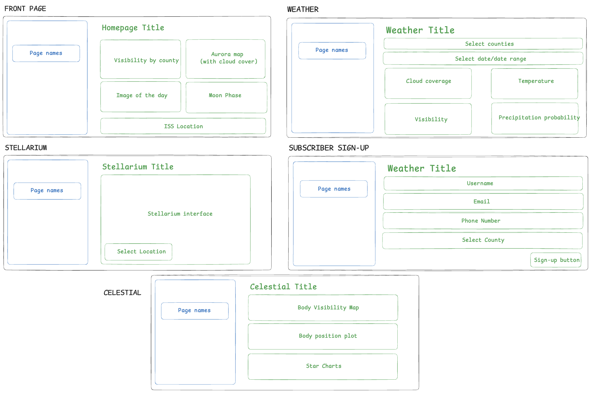

# StarWatch Dashboard
This folder contains the scripts to run and dockerise the dashboard for the StarWatch pipeline project. The pipeline was created using `streamlit` and queries data from a postgres database using `psycopg2`. Along with this, requests are also made to the [NASA APOD API](https://api.nasa.gov/) and [ISS API](http://open-notify.org/Open-Notify-API/ISS-Location-Now/).

## Design
#### The StarWatch Architecture Design

#### The StarWatch Dashboard Design Wireframe
 

# Setup
1. Ensure that an SQL server RDS has been setup prior and is accessible.
    - Note: be sure to store the credentials for accessing this database safely.

### To Run Locally:
2. Setup a venv and install the requirements.
```bash
python -m venv venv
source venv/bin/activate
pip install -r requirements.txt
```
3. Create a `.env` file with the following:
    - DB_HOST - to access your RDS instance.
    - DB_USER - username for accessing RDS.
    - DB_PASSWORD - password for accessing RDS.
    - DB_NAME - the name of your database.
    - DB_PORT - port to access RDS (typically 5432 for postgres).
    - NASA_API_KEY - A key to access the NASA API - this can be generated at the link at the top of this README.

### To Run on AWS:
2. Create an ECR repository through terraform or the AWS UI.
In order for your provisioned architecture one must dockerise their scripts and dependencies and push to an ECR repository.  
For the next steps you will require AWS credentials and the ECR URI.

3. Download the aws-cli:
```bash
brew install awscli
```
4. Verify your credentials:
```bash
aws configure
```
This will require sensitive information to be entered through the command line.

5. Add to your `.env` file the following:
    - AWS_REGION - region of your ECR repository.
    - ECR_URI - endpoint of the ECR repository.
    - IMAGE_NAME - a name given to your docker image.

6. Run the following command to automatically dockerise and push to ECR:
```bash
bash deploy.sh
```
7. Now follow the terraform setup steps in the `../terraform` folder to provision an ECS task definition based off of this docker image.

## Usage
- To use locally one can use the following command:
```bash
streamlit run Homepage.py
```
It is a good idea to ensure that the dashboard works with your credentials prior to provisioning the AWS architecture, it should be available via a local URL printed to terminal upon running the streamlit dashboard.

- To run tests run the following command:
```bash
pytest
```
Alternatively to run specific tests or test files:
```bash
pytest path/to/test_file.py
pytest path/to/test_file.py::test_function_name
```
To get a coverage report execute the following;
```bash
pytest --cov
```

## How it works
For clarity, the StarWatch dashboard has been subdivided into pages, each with a specific content focus. After running the dashboard, and navigating to the dashboard URL, these pages can be accessed using the sidebar feature, which, if not visible, can be opened using the arrow in the top-left corner.

### - Page 1: Home Page
`'Current Aurora Status'`

Shows aurora activity around the UK overlaid with the current cloud cover by county. Combining these two factors give a holistic representation of the likelihood that inhabitants of each county will currently be able to see aurora activity in their.

`'Tonight's visibility'`

Combines data on cloud coverage and local visibility to give a comprehensive evaluation of how good the conditions are in each county for stargazing.

`'Image of the day'`

The "NASA Image of the Day" taken directly from the NASA API. This is updated daily and can have a focus of any space/astronomy related topics.

`'Today's moon phase'`

Shows a daily image and description of the current moon phase.

`'Current ISS Location'`

Shows the current location of the International Space Station (ISS) relative to a world map.

`'Data Sources'`

Logo images and URL links of the API data sources used.

### - Page 2: Astronomy

<span style="color:magenta;">Celestial Body Select Box</span>:

Select box that allows you to filter the astronomy visualisations by celestial body. Includes all non-earth solar system planets, the sun, and the moon.

`'<BODY> Visibility Across the UK'`

Shows if the specified celestial body is visible in each county overlaid with the cloud coverage of each county to give a holistic representation of the likelihood that inhabitants of each county will currently be able to see the specified celestial body.

`'<BODY> Star Chart'`

Shows a star chart of the constellation that the specified celestial body can be located in.

<span style="color:magenta;">Region Select Box</span>:

Select box that allows you to filter the following two visualisations by UK region.

<span style="color:magenta;">Date Select Box</span>:

Select box that allows you to choose a single date to filter the following two visualisations.

`'What Has Been Visible In Your Region'`

Heatmap showing the historical visibility of the specified body from the specified region.

`'Skyplot for <COUNTY> on <DATE>'`

Plot showing the azimuth and altitude angles of the visible bodies from the specified region on the specified date from the hours of 18:00 to 05:00 in three hour intervals.

### - Page 3: Stellarium

`'Interactive Night Sky View'`

Shows an interactive map of the night sky that can be customised by location using a build in drag-and-drop pin map. This feature also contains several different visual filters that can be toggled using the icons at the bottom of the window. Current date and time are displayed below.

### - Page 4: Subscribe

<span style="color:magenta;">Desired Username Input Box</span>:

Input box to insert desired user username.

<span style="color:magenta;">Email Address Input Box</span>:

Input box to insert user email address.

<span style="color:magenta;">Phone Number Input Box</span>:

Input box to insert user phone number.

<span style="color:magenta;">County Multi-Select Box</span>:

Multi-select box for UK counties. A user can use this box to select all of the counties that they would like to receive relevant alerts for.

### - Page 5: Weather

<span style="color:magenta;">County Select Box</span>:

Select box that allows you to filter the visualisations on the weather page by UK county.

<span style="color:magenta;">Date Select Box</span>:

Select box that allows you to filter the visualisations on the weather page by date. This selection can be a single date or a date range.

`'Cloud Coverage Over Time (Real vs. Rolling Average)'`

Shows cloud coverage by date up to 100% and a rolling average of cloud coverage (shown by the grey line).

`'Temperature Over Time (Real vs. Rolling Average)'`

Shows temperature by date in degrees Celcius and a rolling average of temperature (shown by the grey line).

`'Visibility Over Time (Real vs. Rolling Average)'`

Shows visibility by date up to 50,000 metres and a rolling average of visibility (shown by the grey line).

`'Precipitation Probability (%) and Precipitation (mm) Over Time'`

Shows both precipitation probability and precipitation over time.

