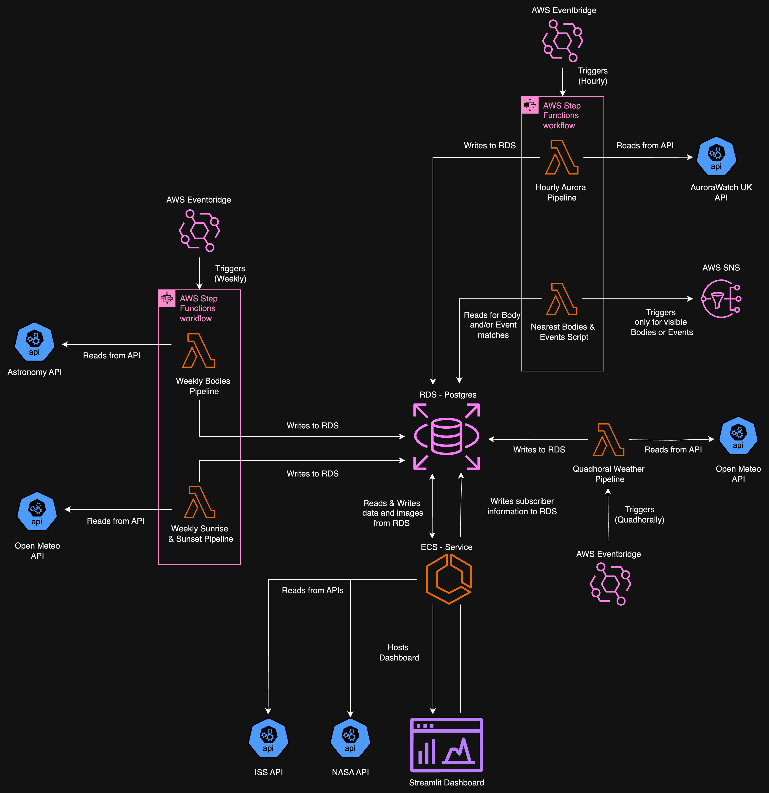

# StarWatch Dashboard
This folder contains the scripts to run and dockerise the dashboard for the StarWatch pipeline project. The pipeline was created using `streamlit` and queries data from a postgres database using `psycopg2`. Along with this, requests are also made to the [NASA APOD API](https://api.nasa.gov/) and [ISS API](http://open-notify.org/Open-Notify-API/ISS-Location-Now/).

## Design
#### The StarWatch Architecture Design

#### The StarWatch Dashboard Design Wireframe
 

# Setup
1. Ensure that an SQL server RDS has been setup prior and is accessible.
    - Note: be sure to store the credentials for accessing this database safely.

### To Run Locally:
2. Setup a venv and install the requirements.
```bash
python -m venv venv
source venv/bin/activate
pip install -r requirements.txt
```
3. Create a `.env` file with the following:
    - DB_HOST - to access your RDS instance.
    - DB_USER - username for accessing RDS.
    - DB_PASSWORD - password for accessing RDS.
    - DB_NAME - the name of your database.
    - DB_PORT - port to access RDS (typically 5432 for postgres).
    - NASA_API_KEY - A key to access the NASA API - this can be generated at the link at the top of this README.

### To Run on AWS:
2. Create an ECR repository through terraform or the AWS UI.
In order for your provisioned architecture one must dockerise their scripts and dependencies and push to an ECR repository.  
For the next steps you will require AWS credentials and the ECR URI.

3. Download the aws-cli:
```bash
brew install awscli
```
4. Verify your credentials:
```bash
aws configure
```
This will require sensitive information to be entered through the command line.

5. Add to your `.env` file the following:
    - AWS_REGION - region of your ECR repository.
    - ECR_URI - endpoint of the ECR repository.
    - IMAGE_NAME - a name given to your docker image.

6. Run the following command to automatically dockerise and push to ECR:
```bash
bash deploy.sh
```
7. Now follow the terraform setup steps in the `../terraform` folder to provision an ECS task definition based off of this docker image.

## Usage
- To use locally one can use the following command:
```bash
streamlit run homepage.py
```
It is a good idea to ensure that the dashboard works with your credentials prior to provisioning the AWS architecture, it should be available via a local URL printed to terminal upon running the streamlit dashboard.

- To run tests run the following command:
```bash
pytest
```
Alternatively to run specific tests or test files:
```bash
pytest path/to/test_file.py
pytest path/to/test_file.py::test_function_name
```
To get a coverage report execute the following;
```bash
pytest --cov
```
## How it works
For clarity, the StarWatch dashboard has been subdivided into pages, each with a specific content focus. After running the dashboard, and navigating to the dashboard URL, these pages can be accessed using the sidebar feature, which can be opened using the arrow in the top-left corner.

### Page 1 - Front Page


### Page 2 - Weather

### Page 3 - Astronomy

### Page 4 - Stellarium

### Page 5 - User Sign-Up
