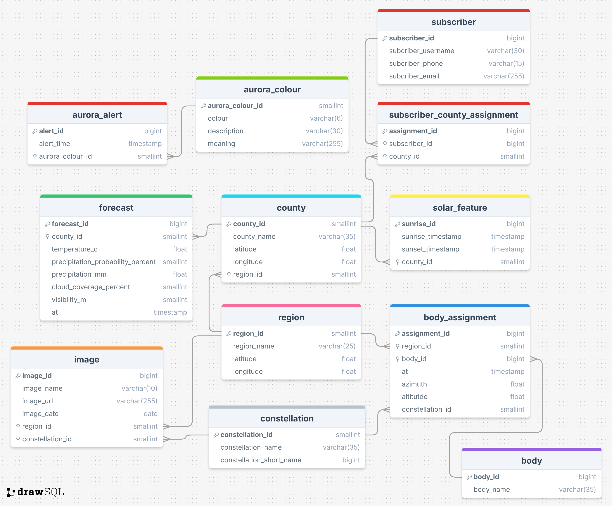

# StarWatch Database
This folder contains the scripts to create the database, database tables(as shown in _Figure 1_) and seed each table with static data. There are shell scripts included that automate distinct tasks related to resetting, seeding and querying the database

## Design

__Figure 1__ - _Starwatch Database ERD_: Shows the entity relationship diagram for the database used in this project.

## Setup
### To Run Locally:
1. Ensure that PostgreSQL is installed on your machine.

2. Create a database using ```'psql postgres -c 'CREATE DATABASE <your_database_name_here>;'```
    - Example: `'psql postgres -c 'CREATE DATABASE starwatch;'`

3. Create a `.env` file with the following:
    - DB_HOST - the host of your database (typically localhost)
    - DB_USER - username for accessing the database
    - DB_NAME - the name of your database
    - DB_PORT - port to access database (typically 5432)

### To Run on AWS:
1. Ensure that an SQL server RDS has been setup prior and is accessible.
    - Note: be sure to store the credentials for accessing this database safely.

2. Create a `.env` file with the following:
    - DB_HOST - to access your RDS instance
    - DB_USER - username for accessing RDS
    - DB_PASSWORD - password for accessing RDS
    - DB_NAME - the name of your database
    - DB_PORT - port to access RDS (typically 5432 for postgres)

## Usage
- To create the initial tables and seed the static data tables (aurora_colour, region, county, body, and constellation):
```bash reset.sh```
    - This can also be run again to reset the database back to the starting point.
- To connect to the database in an interactive session:
```bash connect.sh```
- To seed that database with some test data in the dynamic tables (aurora_alert, forecast, image, subscriber, subscriber_county_assignment, solar_feature, body_assignment):
```bash seed_test.sh```
- To delete all the data in the dynamic tables excluding subscriber related tables (solar_feature, aurora_alert, image, forecast, body_assignment):
```bash truncate.sh```
- To pass in a specific query to the database (The query must be enclosed in single quotes):
```bash query.sh 'YOUR QUERY HERE'```
    - Example: `bash query.sh 'SELECT * FROM body;'`
- To get the current count of the total rows in each of the dynamic tables excluding subscriber related tables (solar_feature, aurora_alert, image, forecast, body_assignment):
```bash count.sh```

## How it works
#### `fake_data.sql`
- Uses SQL DML to fill the dynamic tables with fake data for testing purposes.
#### `schema.sql`
- Uses SQL DDL to create all the tables in the database as per the ERD above. Then uses SQL DML to seed the static data.
#### `connect.sh`
- A short bash script to connect to the database.
#### `count.sh`
- A short bash script to get information from the database.
#### `query.sh`
- A short bash script to get custom information from the database.
#### `reset.sh`
- A short bash script to set up or reset the database.
#### `seed_test.sh`
- A short bash script to seed the database with test data.
#### `truncate.sh`
- A short bash script to remove dynamic data from the database.