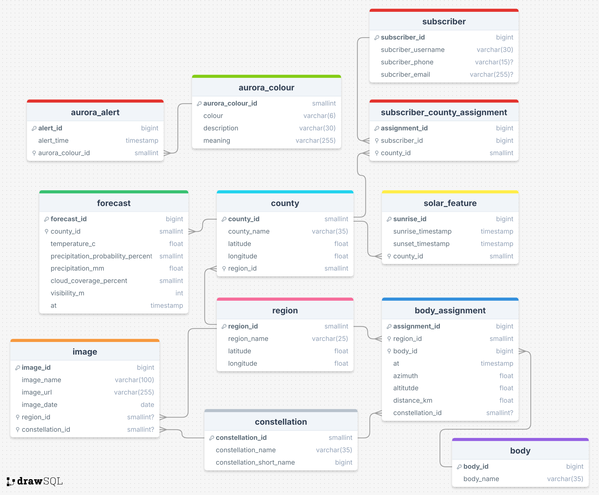

# StarWatch Database
This folder contains the scripts to create the database, database tables(as shown in _Figure 1_) and seed each table with static data. There are shell scripts included that automate distinct tasks related to resetting, seeding and querying the database

## Design

__Figure 1__ - _Starwatch Database ERD_: Shows the entity relationship diagram for the database used in this project.

## Setup

## Usage

## How it works